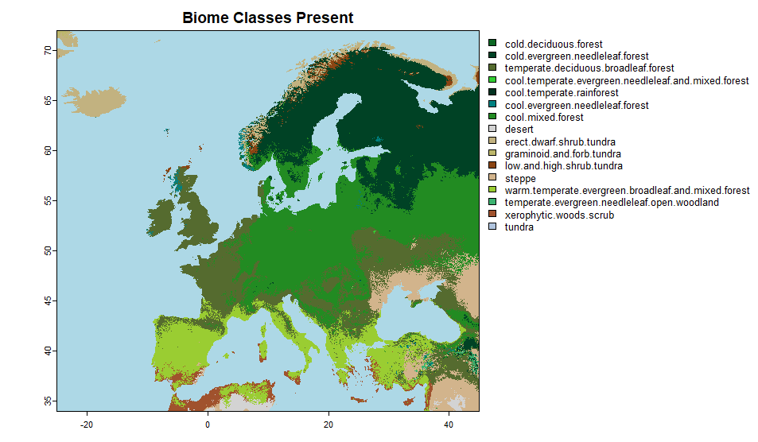
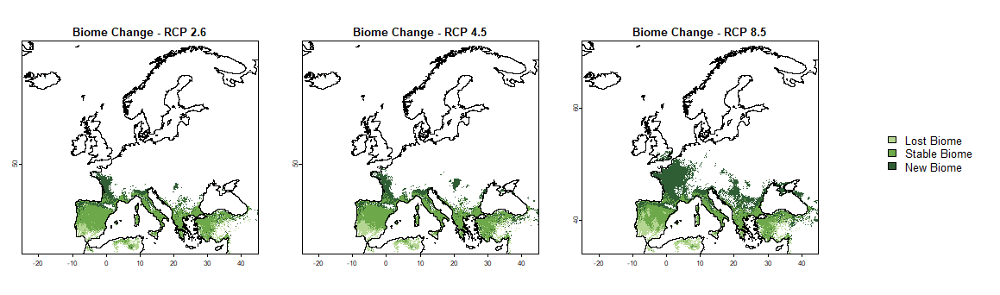
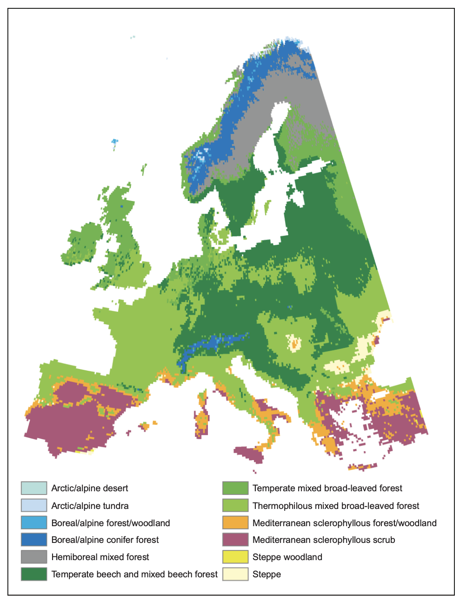

```{r message=FALSE, warning=FALSE, include=FALSE}
library(knitr)
library(kableExtra)
```


# Mapping of Potential Natural Vegetation with Machine Learning Methods

*Author: Elena Pellerano & Julius Weiss *

*Supervisor: Henri Funk*

## Abstract

 Climate change is expected to significantly affect the distribution of vegetation across Europe. Traditionally, such questions are addressed by classical ecological inference at small spatial scales or by process-based Dynamic Global Vegetation Models (DGVMs). Following and replicating the data-driven approaches of @hengl2018 and @bonannella2023, this study implements a random forest model to predict the spatial distribution of European biomes using a historical pollen dataset and environmental covariates  (climate and topography). In addition to predicting the current Potential Natural Vegetation (PNV), the model projects PNV distributions under three future climate change scenarios (RCP 2.6, 4.5 and 8.5) by varying the climatic covariates. The prediction of present-day PNV achieves an accuracy of 0.69 and a Cohen’s kappa of 0.66, with high true positive rates (TPRs) for most classes. The most important predictors were winter temperature and precipitation. Future projections indicate a northward shift of Mediterranean vegetation into continental and central Europe and, under RCP 8.5, the onset of desertification in the southern Iberian Peninsula. The study concludes by discussing how machine learning approaches such as the reproduced example can contribute to current biogeographical research and ecological management practices.


## Introduction 
Understanding and modelling vegetation distribution is central to biogeography and ecology, particularly in the context of rapid anthropogenic climate change (@fisher2018; @smith2023). Across Europe, recent unprecedented warming (0.2 to 0.3 °C per decade) has already been observed, and future impacts strongly depend on upcoming emissions pathways (@ipcc2021). Current projections suggest continued warming, shifts in precipitation regimes, increased frequency of extreme events, and seasonal imbalances, including wetter winters and increasingly dry summers (@coppola2021; @leduc2019; @palmer2021; @samaniego2018). These climatic shifts fundamentally alter conditions for plant physiological processes, driving range shifts, altering community composition, and disrupting ecosystem functions (@forzieri2021; @kramer2020). Depending on the scenario, substantial changes in Europe's biomes are projected for the near future (@hickler2012). 

To anticipate these vegetation responses, the concept of Potential Natural Vegetation (PNV) provides a valuable ecological baseline. PNV represents the vegetation cover hypothetically expected under current climatic and environmental conditions, in the absence of direct human influences (@levavasseur2012). Unlike historical vegetation, which reflects past climates, or actual natural vegetation, often degraded by modern land-use practices, PNV offers a meaningful benchmark for distinguishing anthropogenic from climate-driven changes and guiding ecological restoration and landscape management (@ni2006; @weisman2008). 

Traditionally, Dynamic Global Vegetation Models (DGVMs) simulate vegetation dynamics based on mechanistic understanding of environmental and physiological processes (@hickler2012; @prentice2007). Although robust, modular and intercomparable, these models are computationally intensive, often limited in spatial resolution, and rely on numerous abstractions, assumptions and extensive parameterization (@prentice2007). In contrast, machine learning (ML) approaches utilize large, diverse, and high-resolution datasets, detecting non-linear ecological relationships without strict theoretical constraints (@pichler2023). They offer high scalability, computational efficiency, and quantifiable uncertainty estimates, enhancing their suitability for extensive spatial modelling (@lindgren2021). However, their ability to extrapolate to novel environmental conditions or spatially unobserved regions remains a key uncertainty in environmental sciences (@meyer2021). 

Following @hengl2018 and @bonannella2023, this term paper employs a Random Forest classifier to model biome distribution across Europe, under current and future climate scenarios (RCP 2.6, 4.5 and 8.5). The study hereby addresses two key research questions: 

- How effectively can machine learning methods predict current biome distributions ecologically meaningfully and spatially accurately? 

- How reliably can these models project future biome shifts under anticipated climate scenarios? 

In a concluding discussion, the implications of the model results will be examined, as well as the extent to which ML approaches can extend classical approaches to ecological modelling at different integration scales. 

## Materials and Methods

This study utilizes the BIOME 6000 dataset for training, focusing on the task of classification of biomes in Europe, with a resolution of 1kmx1km under the assumption of potential natural vegetation, based on climatological and topographical covariates, as well as predictions under various future climate scenarios. The foundational study by @hengl2018 used the same dataset along with 160 covariate layers. However, due to computational constraints, the present work limits the covariates to 71, selected based on prior knowledge of their likely impact on vegetation. The following sections provide a detailed description of the data and methods used. 

### Biome 6000 
The BIOME 6000 dataset (@harrison2017) was used to predict Potential Natural Vegetation (PNV), following the methodology of @hengl2018. The dataset is based on vegetation reconstructions derived from modern pollen samples. It aggregates data from multiple sources and initially produced regional maps, with additional regions incorporated over time. 

Some locations in the BIOME 6000 dataset contain multiple reconstructions based on nearby modern pollen samples (up to 30), potentially introducing modeling bias. To mitigate this, we selected only the most frequently reconstructed biome at each site. In cases with two equally frequent reconstructions, both were retained as observations. 

The number and types of biomes identified vary across regions, with certain biomes reconstructed only in specific areas where they are particularly distinctive. Notably, some biomes visible in the modern landscape were not reconstructed in the BIOME 6000 dataset. The dataset is heavily concentrated in the Northern Hemisphere, with strong coverage in Europe and North America, but sparser data in Asia and North Africa. Coverage is particularly limited in Africa, Oceania, and South America, potentially affecting model generalizability. Consequently, we trained the model on global data but restricted predictions to Europe, where model performance is expected to be more robust. The exact distribution of the points in the world can be seen in Figure \@ref(fig:biome).

```{r biome, fig.cap="Site of Collection of the Biome6000 samples used in the project", out.width = "80%", fig.align = "center", echo=FALSE}
knitr::include_graphics("work/05-naturalveg/figures/Biome6000.jpeg")

```


Simplified or “megabiome” classifications (@harrison2012) often result in significant information loss. Therefore, we adopted a more detailed classification scheme similar to @hengl2018. However, since their reclassification scheme was not made publicly available, we developed our own taxonomy consisting of 20 biome classes. Classes with fewer than five observations were removed, and similar classes were merged based on geographic proximity and results from preliminary modeling using the original data. 

###  Covariates

A total of 71 covariate layers were used in the model. Of these, 65 were climatological layers from the CHELSA dataset (@karger2017), and 6 were topographical layers derived from NASA’s digital elevation model (DEM) (@nasa2019), using calculations performed in R and SAGA GIS (@conrad2015). Initially, we also considered a lithology map containing 17 categories (@hartmann2012), but it was excluded due to limited explanatory power and extensive missing data. Other covariates used by @hengl2018 were excluded either due to inaccessibility or because they are not suitable for future climate projections, as they cannot be assumed to remain constant over the next 60–80 years, and no future scenarios are available for them. 

- Climatological Covariates: The CHELSA dataset includes 67 layers, comprising average monthly mean, maximum, and minimum temperatures, as well as 19 bioclimatic variables (@karger2017), including: 
   - Annual mean temperature 
   - Mean diurnal range 
   - Isothermality 
   - Temperature seasonality (standard deviation of monthly means) 
   - Maximum temperature of the warmest month 
   - Mean temperature of the wettest and driest quarters 
   - Minimum temperature of the coldest month    
   - Temperature annual range 
   - Mean temperature of the warmest and coldest quarters 
   - Annual precipitation 
   - Precipitation of the wettest and driest months 
   - Precipitation of the wettest, driest, warmest, and coldest quarters  
   Present-day PNV predictions are based on climatological data from 1979–2013. For future scenarios, projections for the period 2061–2080 were used, as this is the furthest time horizon for which consistent predictions are available. Final predictions were made for a reference future scenarios (RCPs 2.6, 4.5, 8.5) based on climatic covariate variations from the CanESM2 (CMIP5) model within the BIOCLIM dataset (@karger2017). These reflect increasing levels of greenhouse gas emissions and warming in Europe: RCP 2.6 (~1.5–2°C, strong mitigation), RCP 4.5 (~2.5–3°C, moderate mitigation), and RCP 8.5 (>4°C, high emissions, minimal mitigation).  The goal hereby lied exploring how biome distributions in Europe could potentially shift under these different climate scenarios, as projected by the RF model trained on current climatic and environmental conditions.

- Topographical Covariates: 
 Derived from the NASA DEM(@nasa2019), we used slope, topographic position index (TPI), and general curvature, calculated using R and SAGA GIS (@conrad2015). These variables were assumed to remain constant across present and future scenarios. 


### Random forest

A Random forest models (@breiman2001, @cutler2007, @biau2016) was selected for this study based on its superior performance in @hengl2018, where five modeling approaches were compared and random forests yielded the highest accuracy. The model was implemented in R using the caret (@kuhn2008) and ranger (@marvin2017) packages. A five-fold cross-validation strategy, repeated twice, was employed for model training. Hyperparameters were optimized based on accuracy. The model returns a probability matrix giving probabilities for each class. For each scenario, the class with the highest predicted probability from the model output was assigned as the hard-label classification at each point. 
redictions were performed over a uniform 1 km × 1 km grid covering the entirety of Europe.
 

### Performance metrics 
To evaluate the predictive performance of the model for each class, we computed the True Positive Rate (TPR). The TPR, also known as sensitivity or recall, is a widely used metric for assessing classification models. It measures the proportion of actual positive instances that are correctly identified by the model, thereby providing insight into its ability to detect the presence of each class. It is calculated as:

$$
\text{TPR} = \frac{\text{TP}}{\text{TP} + \text{FN}}
$$

A TPR value of 1 indicates perfect classification performance for a given class, while values closer to 0 reflect poor performance in identifying that class. In general, a TPR below 0.5 is considered indicative of poor model performance.

To assess the model’s prediction uncertainty, we also computed the Scaled Shannon Entropy Index (SSEI) (@shannon1949), which is based on the probability distribution over the predicted classes. The SSEI is defined as:

$$
\text{SSEI}_s(x) = -\sum_{i=1}^{b} P_i(x) \cdot \log_b P_i(x)
$$

This can also be expressed using natural logarithms and normalized to the range [0, 1] as:

$$
\text{SSEI}_s(x) = \frac{-\sum_{i=1}^{b} P_i(x) \cdot \log P_i(x)}{\ -b \cdot b^{-1}\cdot log{b^{-1}}}
$$

where \( P_i(x) \) is the predicted probability of class \( i \) for observation \( x \), and \( b \) is the total number of classes. An SSEI close to 1 indicates maximum uncertainty, where the model assigns similar probabilities to all classes. In contrast, an SSEI close to 0 suggests high confidence, where one class receives a dominant probability while the others are near zero.


## Results


The selected Random Forest model achieved an accuracy of approximately 0.69 and a Cohen's Kappa of approximately 0.66. The True Positive Rate (TPR) values for each class were computed and are presented in Table \@ref(tab:table2). It can be observed that the TPR values for all classes are well above 0.5, with most exceeding 0.75. The highest TPRs were observed for the classes Temperate Sclerophyll Woodland and Shrubland (TPR = 0.9844) and Cold Evergreen Needleleaf Forest (TPR = 0.9684). Generally, classes with higher frequency also exhibit higher TPRs, whereas classes with very low frequency tend to have lower TPRs. 

This is exemplified by Tundra, which had the lowest TPR of 0.6754, and Graminoid and Forb Tundra, the second-lowest with a TPR of 0.64 and only 50 observations. This could be due to the coexistence of these biomes within the same regions, along with similar values in predictor variables, leading to greater confusion in the model and increased misclassification in these areas. 

While merging some of these classes might result in higher per-class TPRs and improved overall accuracy, it would also reduce ecological detail and result in a loss of valuable information. Therefore, we opted to preserve as much biome diversity as possible, including highlighting areas, even in Europe, where predictions are less confident. 

```{r, echo=FALSE, results="asis", label="table1"}

# Sample data frame
df <- read.csv("work/05-naturalveg/data/Table2.csv") # Load the table from the CSV file
# Display the table with caption and label
kable(df, caption = "The table presents the True Positive Rate (TPR) and frequency for each biome class. The TPR values indicate the model's sensitivity in correctly identifying instances of each biome class, while the frequency values reflect the occurrence of each class in the dataset.", label = "table2")
```


### Feature importance

Feature importance for all 70 predictors used in the model was obtained using the pre-implemented function in the caret package (@kuhn2008), which evaluates variable importance based on the frequency with which a variable is selected for a split in the model. When interpreting these results, it is important to note that the features provided by CHELSA represent average values calculated over the years 1979 to 2013. Therefore, they reflect long-term climatic conditions rather than data from a specific year.

Feature importance values are presented in Table \@ref(tab:table3), where the ten most important and ten least important predictors are listed. The importance of the top predictor is set to 100, and the values for all other predictors are scaled proportionally relative to this maximum.

```{r, echo=FALSE, results="asis", label="table3"}


# Sample data frame
df <- read.csv("work/05-naturalveg/data/Table3.csv") # Load the table from the CSV fi
 colnames(df)<- c("Top 10 Features", "Importance", "Bottom 10 Features", "Importance")
 
# Display the table with caption and label
kable(df, caption = "The Table displays the 10 most important predictors of the model and 10 least important predictors in the model with respective relativ eimportance value. The vairbale names can be seen in column 1 and 3 wheras their importance values cna be seen in columns 2 and 4", label = "table3")
```

As shown in Table \@ref(tab:table3), the most important feature was found to be the maximum temperature in February. Interestingly, minimum temperatures in January, December, and November also appear among the top five predictors, suggesting that maximum temperatures during the coldest season in the Northern Hemisphere (where most of our data is collected) play a significant role in distinguishing between biomes.

Other important predictors include isothermality, mean diurnal range, elevation, and annual precipitation, all of which are plausibly relevant to vegetation distribution.

In contrast, when examining the ten least important features, it becomes evident that minimum temperatures generally carry less information about vegetation patterns—six out of the ten least important predictors are either minimum temperature values or derived from minimum temperature layers. Additionally, some average yearly temperature variables also appear to be of low importance. One such example is average annual temperature, which, due to being averaged over many years, may become too generalized and fail to represent current or seasonal climate variations effectively.

These findings suggest that minimum temperatures and precipitation might be less critical in determining vegetation types. Based on these results, it may be possible to develop a more parsimonious model by removing or aggregating some of the less informative predictors. Given the high correlation among many predictors, we believe that such a model could potentially achieve similar performance while being more efficient.


### Biome Classification Maps


```{r mappres, fig.cap="Map of Hard classified Potential Natural Vegetation  predictions in Europe for the present times.", out.width = "100%", fig.align = "center", echo=FALSE}




```

```{r map26, fig.cap="Map of Hard classified Potential Natural Vegetation  predictions in Europe for the years 2061-2080 for RCP 2.6.", out.width = "100%", fig.align = "center", echo=FALSE}

knitr::include_graphics("work/05-naturalveg/figures/eu_pred_26_2c.png")


```


```{r map45, fig.cap="Map of Hard classified Potential Natural Vegetation  predictions in Europe for the years 2061-2080 for RCP 4.5.", out.width = "100%", fig.align = "center", echo=FALSE}

knitr::include_graphics("work/05-naturalveg/figures/eu_pred_45_2c.png")


```

```{r map85, fig.cap="Map of Hard classified Potential Natural Vegetation  predictions in Europe for the years 2061-2080 for RCP 8.5.", out.width = "100%", fig.align = "center", echo=FALSE}
 knitr::include_graphics("work/05-naturalveg/figures/eu_pred_85_2c.png")

```


In Figure \@ref(fig:mappres), the hard-classified predictions for the present (1979–2013) are shown. The model predicts a wide range of biomes across Europe—a total of 16 classes. The most prominent biomes include warm temperate evergreen broadleaf and mixed forest, across southern Europe; temperate deciduous broadleaf forest in France, Ireland, Great Britain, and parts of Eastern Europe; cool mixed forest in Germany and Eastern Europe; and cold evergreen needleleaf forest in the Scandinavian Peninsula. Various tundra types appear in Iceland and Norway, while xerophytic wood and scrub vegetation are present in some southernmost regions of Europe.

Overall, the predictions appear accurate and largely consistent with the observed current biome distribution, although some uncertainty remains—particularly concerning the differentiation between tundra types. One notable exception is central Turkey, where the model predicts the presence of steppe, which does not accurately reflect the observed vegetation.

In Figure \@ref(fig:map26), the predicted biomes under the RCP 2.6 scenario for the period 2061–2080 are shown. Notably, the class cool evergreen needleleaf forest is no longer predicted in this or subsequent scenarios. The model indicates a general shift toward warmer biome types, with xerophytic wood and scrub vegetation expanding in parts of Spain and the emergence of small desert areas. There is a clear northward shift of warmer biomes, as seen by the transformation of western France into warm temperate evergreen broadleaf and mixed forest, better observed in Figure \@ref(fig:biomechange), Germany into temperate deciduous broadleaf forest, and the appearance of cool mixed forest in southern Scandinavia, indicating a retreat of colder biomes.

In Figure \@ref(fig:map45), predictions for the RCP 4.5 scenario (2061–2080) indicate an even more pronounced shift toward warmer biomes. Cold evergreen needleleaf forests are further reduced, and temperate deciduous broadleaf forest expands significantly across central and eastern Europe. A substantial reduction in tundra classes is also observed. Nevertheless, the difference between the RCP 2.6 and RCP 4.5 scenarios is not as drastic as one might expect, suggesting a relatively gradual transition in biome distributions under moderate emissions.

Finally, Figure \@ref(fig:map85) shows the model's predictions for the RCP 8.5 scenario (2061–2080), in which the shift toward warmer biomes becomes most extreme. These projections differ significantly from the present-day distribution. Cool evergreen needleleaf forest remains only in isolated patches on the Scandinavian Peninsula, where it is almost entirely replaced by cool mixed forest, now confined to scandinavia and alpine regions. Central Europe and France are predominantly covered by warm temperate evergreen broadleaf and mixed forest. A particularly concerning development is the appearance of large desert areas in parts of southern Spain, as can be best observed in Figure \@ref(fig:desertchange)reflecting the profound ecological consequences associated with high-emission climate scenarios.


```{r desertchange, fig.cap= "Changes in desert coverage across the Iberian Peninsula and North Africa under present and future climate predictions (RCP 2.6, 4.5, and 8.5).", out.width = "100%", fig.align = "center", echo=FALSE}
 knitr::include_graphics("work/05-naturalveg/figures/desert_change2.png")

```

```{r biomechange, fig.cap=" Changes in warm temperate evergreen broadleaf and mixed forest coverage in Europe under present and future climate predictions (RCP 2.6, 4.5, and 8.5). ", out.width = "100%", fig.align = "center", echo=FALSE}
 

```


```{r ssei1, fig.cap="Scaled Shannon entropy index for the model's predictions, (right) present (1979-2013), (left) 2061-2081 under RCP 2.6", out.width = "100%", fig.align = "center", echo=FALSE}
 knitr::include_graphics("work/05-naturalveg/figures/combined_ssei1.png")

```

```{r ssei2, fig.cap="Scaled Shannon entropy index for the model's predictions, (right) 2061-2081 under RCP 4.5, (left) 2061-2081 under RCP 8.5", out.width = "100%", fig.align = "center", echo=FALSE}
 knitr::include_graphics("work/05-naturalveg/figures/combined_ssei2.png")

```
The Scaled Shannon Entropy Index (SSEI) was calculated at each grid point based on the class probabilities output by the model. Figure \@ref(fig:ssei1) and Figure \@ref(fig:ssei2) present the SSEI for the present (1979–2013) and future (2061–2081) scenarios. These maps illustrate spatial patterns of prediction uncertainty, with brighter (yellow) areas indicating higher uncertainty. In Figure \@ref(fig:ssei1), the present-day predictions generally show lower uncertainty compared to future projections, with the exception of some northern regions in Europe.

Among the future scenarios, predictions under RCP 2.6 and RCP 4.5 are generally more certain than those under RCP 8.5. Areas such as Ireland, England, and central Europe exhibit relatively confident predictions, whereas regions including Iceland, the westernmost parts of the Scandinavian Peninsula, and Turkey show consistently higher uncertainty. For Iceland and Norway, this may be attributed to the presence of biomes such as tundra and graminoid-forb tundra, which occur infrequently and share similar climatic niches. This overlap likely results in similar class probabilities across these biomes, thus increasing the SSEI.

Turkey presents a particularly interesting case: while model uncertainty is high in present-day predictions, it appears to decrease under future scenarios, reaching its lowest levels under RCP 8.5. This pattern, which runs counter to the general trend, may be explained by projected warming that brings Turkey's climate closer to that of other well-sampled regions such as North Africa, or to climatic zones dominated by fewer, more distinct biomes. As a result, the model may be able to make more confident predictions due to reduced ambiguity in biome suitability.

## Discussion 


### Evaluation of Model results

Both the model accuracy and the spatial distribution of PNV agree well with the results of hengl2018 and other classical PNV Maps of Europe, demonstrating the replicability of our approach (bohn1993; bohn2003). The assessed feature importance again highlights the dominant role of climate in predicting vegetation patterns, even above topographic and the not included but anteriorly assessed geological features (holdridge1967; @mather1968). Future work should assess the importance of edaphic features, although there are few global products of potential soil maps in the absence of anthropogenic influences and those which exist, also are using climate as main predictor, e.g. Soil Grids from (@hengl2017). 

Given the strong influence of climate, the projected changes under the different RCP scenarios were largely expected. The general trend (such as the continental expansion of Mediterranean-type vegetation into Central Europe and even more water scarce conditions in Mediterranean areas, esp. the Iberian peninsula) is consistent with findings from other studies (@hickler2012). However, direct comparisons are challenging, as our model uses different biome classifications than most Dynamic Global Vegetation Models (DGVMs), which each rely on their uniquely parametrized PFTs (sitch2008). Moreover, our approach does not account for the complex and interacting feedbacks in vegetation responses to environmental change in the same way as process-based models. The maps we produced reflect the expected equilibrium distribution of PNV, based solely on climate and topography. Achieving this equilibrium can take up to 300 years (@hickler2012), whereas DGVMs simulate transient, time-lagged responses of vegetation to both historical and current environmental conditions. 

Despite these differences, the long-term equilibrium map produced by @hickler2012 under the A2 scenario (comparable to something in between RCP4.5 and RCP8.5) using the DGVM LPJ-GUESS shows generally an agreement with the tendency of our results. Notably, key processes, such as $CO^2$ fertilization, changes in geochemical cycles (esp. nutrient and water cycles), and potential plant physiological adaptations or shifts in biomass allocation, are not included in our model. These remain difficult to represent in data-driven approaches (@bonannella2023). 

```{r mapcomp, fig.cap=" LPJ-Guess model results from @hickler2012 for the long-term equilibrium vegetation distribution using the HadCM3 A2 climate scenario for a climatology between 2071-2100. Map printed for visual comparison with our model results in Chapter 6.3.2. ", out.width = "100%", fig.align = "center", echo=FALSE}
 

```

### Model Improvements, Limitations, and Future Directions 

The Random Forest model presented in this work demonstrated considerable potential for providing fast and reasonably reliable predictions of potential natural vegetation, both under current conditions and future climate scenarios. However, the application of alternative machine learning methods may further improve predictive accuracy and reliability. Additionally, there are many other dataset on vegetation publicly available and the data could be either integrated to have a bigger and more rapresentative dataset.  

Further investigation into the interpretability of the Random Forest model could prove beneficial. In particular, methods such as Shapley values could offer insights into the contribution of individual features to biome classification. However, due to the high dimensionality of features, the number of biome classes, and the associated computational demands, such analyses were considered beyond the scope of this study.

Although our analysis focused on Europe, the model was trained on global pollen data and could, in principle, be applied to other regions. A more tailored model for Europe could be developed by focusing on regionally relevant classes and applying an appropriate reclassification strategy, potentially resulting in more accurate and robust regional predictions.  

In this project, the number of covariates was reduced from the 160 used by @hengl2018 to 70. Nonetheless, we observed that many covariates contributed minimally to model performance, and some were highly collinear. Further dimensionality reduction may therefore be feasible and advantageous, potentially leading to a more interpretable and computationally efficient model. Aggregation of covariates could also be explored, particularly in cases where multiple similiar variables exhibit similar contributions.  

Finally, all projections in this study were based on climate data from the CanESM model. Future work could explore results derived from multiple climate models to assess the consistency and robustness of predictions across different scenarios. Model averaging could be employed to reduce scenario-specific biases and provide more balanced projections of vegetation change.  

### Future Outlook - ML in Ecological Modelling 

The applied example of biome mapping across Europe, including projections under altered climate conditions (especially temperature and precipitation), demonstrates the potential of ML models for rapid, scalable vegetation distribution modelling. What remains is the question of their applicability across integration scales (e.g., at the community or species/population level) and whether they can overcome the stigma of being mere black-box predictors (@pichler2023).

The findings of @hengl2018 and subsequent studies support applications at finer ecological scales. @bonannella2022 show that despite complications from biotic interactions, successional dynamics, environmental heterogeneity and spatial data bias, spatio-temporal ensemble ML models can generate robust and meaningful predictions even for fine-scale forest species distributions in Europe. Crucially, this depends on the availability of large, well-curated datasets and high-resolution covariates.

In terms of possible future applications, ML could delineate niche boundaries and detect emerging suitability hotspots under novel climate conditions, while supporting early warning systems for ecosystem threats or species invasions (@antonelli2023). This presents opportunities not only for biodiversity monitoring and conservation planning, but also for anticipating tipping points by identifying patterns which suggest transitional stages of ecosystems (@bury2021).

Nevertheless, classical data analysis methods for causal inference and statistical models remain essential for interpreting ecological processes and hypothesis testing. ML should be viewed as a complementary tool, especially in data-rich, complex contexts (@bonannella2022; @bonannella2023). Hybrid approaches and explainable AI help bridge predictive performance and interpretability (@pichler2023). The strength of ML lies not only in pattern recognition, but also in supporting evidence-based decisions, especially if the input database is integrated with ecological theory and accompanied by transparent assumptions (@yu2021).


## Conclusion 

The reproduced approach from @hengl2018  in our study shows that Random Forest models can effectively predict PNV across Europe, achieving an accuracy of approximately 0.69 and a Cohen’s Kappa of 0.66. Key climatic drivers, especially cold-season temperatures and precipitation, proved most influential, aligning with ecological theory and previous work (@bonannella2023; @holdridge1967; @koerner2016). The model captured current biome distributions well and projected shifts of vegetation equilibrium towards a continental direction and expansions of warmer, drought-adapted biomes under future climate scenarios. Particularly, under the drastic RCP 8.5, the model even indicated emerging desert zones in southern Europe. 

Despite some uncertainty in sparsely sampled or ecologically ambiguous regions, the results are consistent with DGVM-based projections and suggest that ML models therefore may offer a valuable complement to DGVMs in the future, especially for model intercomparison (@hickler2012; @sato2022). With their ability to generate high-resolution, data-driven forecasts, ML-based maps of potential natural vegetation could then serve as references for assessing uncertainty and validating process-based model outputs, so long as no explicit dynamic processes modulation are required. Future work should focus on advancing the data-driven approach by improving the quality and curation of the datasets and the model constitution itself, enhancing the interpretability of ML models to enable meaningful ecological inference, and evaluating their applicability at finer spatial and biological integration scales. This would help to unlock the full planning potential of high-resolution ML-based products in conservation, restoration and land-use management. 

 
